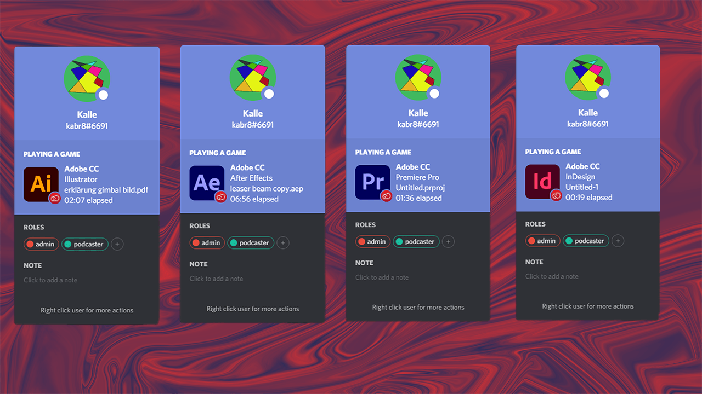
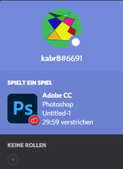
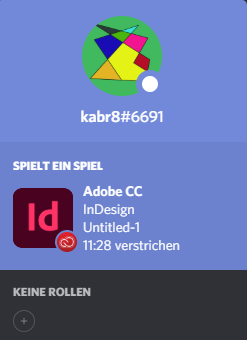
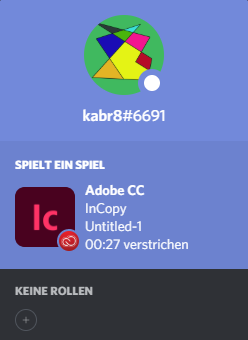
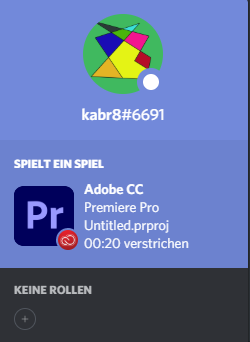
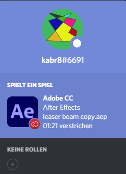

# Discord Connector
Adobe CC extension to add Discord rich press to Discord by using Adobe CEP.

## Supported app
- [x] Photoshop 
- [x] Illustrator
- [x] Premiere Pro
- [x] InDesign
- [x] InCopy
- [x] Prelude
- [x] After Effects
- [x] Animate with issues
- [x] Audition with issus
- [x] Dreamweaver with isuses

## Install
### Install with installer
Download the zip folder [here](https://github.com/Kalbra/discord-connector/releases/download/v1.1/windows_installer.zip). Extract the zip folder, then run the `installer.exe` as administrator.

### Install by hand

- Windows
    - Go to `C:\Program Files\Common Files\Adobe\CEP\extensions` if this not exist go to `C:\Program Files (x86)\Common Files\Adobe\CEP\extensions`
    - Create a new directory called `discord-connector`.
    - Go into this directory(`discord-connector`).
    - Open a CMD at this directory and run `git clone https://github.com/Kalbra/discord-connector.git`.

- Mac
    - Go to `/Library/Application Support/Adobe/CEP/extensions`
    - Create a new directory called `discord-connector`.
    - Go into this directory(`discord-connector`).
    - Open a CMD at this directory and run `git clone https://github.com/Kalbra/discord-connector.git`.

> **Notice**: Git has to be installed to download the files via this method.

> **See also**: [Adobe Extension Folder](https://github.com/Adobe-CEP/CEP-Resources/blob/master/CEP_9.x/Documentation/CEP%209.0%20HTML%20Extension%20Cookbook.md#extension-folders) and [Git installation guide](https://www.atlassian.com/git/tutorials/install-git).

## Contributing
Pull requests and issues are always welcome. You can also suggest a feature by using the [discussion](https://github.com/Kalbra/discord-connector/discussions) tab.

## Showcase

|Photoshop|Illustrator|InDesign|
|---------|-----------|--------|
||||
|
<strong>InCopy</strong>
|
<strong>Premiere Pro</strong>
|
<strong>After Effects</strong>
|
||||

